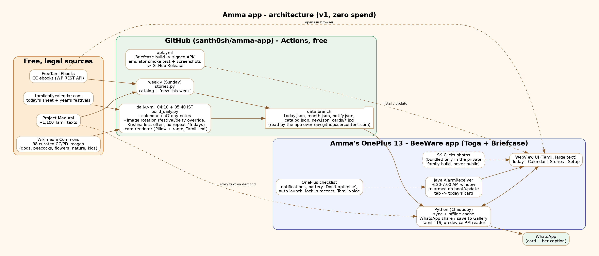

# அம்மா (Amma)

An Android app made for my mother: a daily Tamil calendar, a good-morning card to share on WhatsApp, and free Tamil stories with read-aloud.

## What it does
- **இன்று (Today)** - today's good-morning card (a new picture every day, the festival or deity of the day when there is one), a caption box, and one-tap **Share to WhatsApp** / **Download**. Below it: thithi, nakshatram, nalla neram, rahu kalam and a short note on special days.
- **நாட்காட்டி (Calendar)** - month view with festivals and special days; tap a day for its note.
- **கதைகள் (Stories)** - Project Madurai texts (novels, short stories, devotional works) readable in the app with large text and Tamil read-aloud, plus FreeTamilEbooks titles that open in the browser. Search, browse by category or author, "new this week" badge, and resume where you left off.
- **Morning notification** between 6:30 and 7:00 AM; tapping it opens today's card.
- **அமைப்பு (Setup)** - a one-time OnePlus checklist (notifications, battery "Don't optimise", auto-launch, lock in recents, Tamil voice).

## How it works
- `backend/` - Python jobs run by GitHub Actions (`.github/workflows/daily.yml`), free:
  - `build_daily.py` reads today's sheet and the year's festival list from tamildailycalendar.com, picks the picture (rotation across gods, peacocks, flowers, nature, kids; festival/deity days override it; no repeats within 45 days), and draws the Tamil greeting on it with Pillow + raqm.
  - `stories.py` (weekly) builds the catalog from Project Madurai and FreeTamilEbooks and marks new titles.
  - Output goes to the `data` branch as JSON + JPEG; the app reads it from raw.githubusercontent.com.
- `app/` - BeeWare (Toga + Briefcase). The screens are one local web page in a Toga WebView; Python handles sharing, saving to the gallery, Tamil text-to-speech and downloads. `android-extra/` adds the Java alarm receiver for the morning notification.
- `.github/workflows/apk.yml` builds the APK, smoke-tests it on an emulator, and attaches it to a GitHub Release.

## Sources and licences
- Pictures: Wikimedia Commons, CC / public domain; the author and licence are printed on every card.
- Calendar: tamildailycalendar.com.
- Stories: Project Madurai (free distribution) and FreeTamilEbooks (Creative Commons).

Code: MIT.
